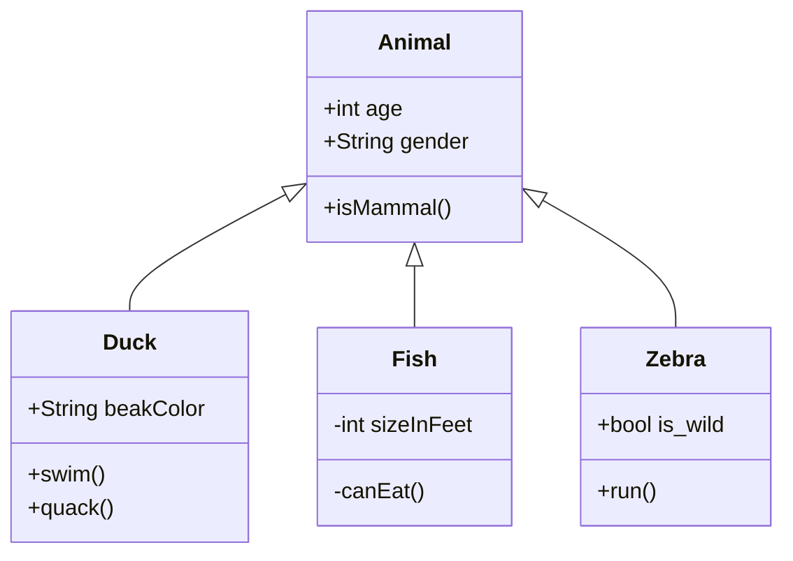

# Filmatoca
Uma alocadara de filmes utilizando como base os padrões de projeto
visto na disciplina e de técnicas de refatoração

### [Conventional_commits](/conventional_commits.md)

`    Animal: +mate()

