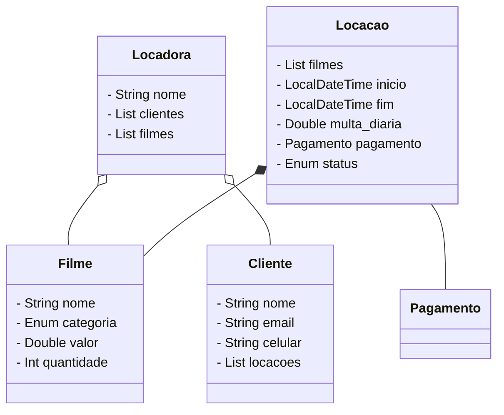

# Filmatoca
Uma alocadara de filmes utilizando como base os padrões de projeto
visto na disciplina e de técnicas de refatoração

### [Conventional_commits](/conventional_commits.md)




## Iniciar projeto com maven

```bash
mvn archetype:generate -DgroupId=com.locadora \
    -DartifactId=locadora-filmes \
    -DarchetypeArtifactId=maven-archetype-quickstart \
    -DinteractiveMode=false
```


```bash
mvn clean package
java -jar target/locadora-filmes-1.0-SNAPSHOT.jar
```
